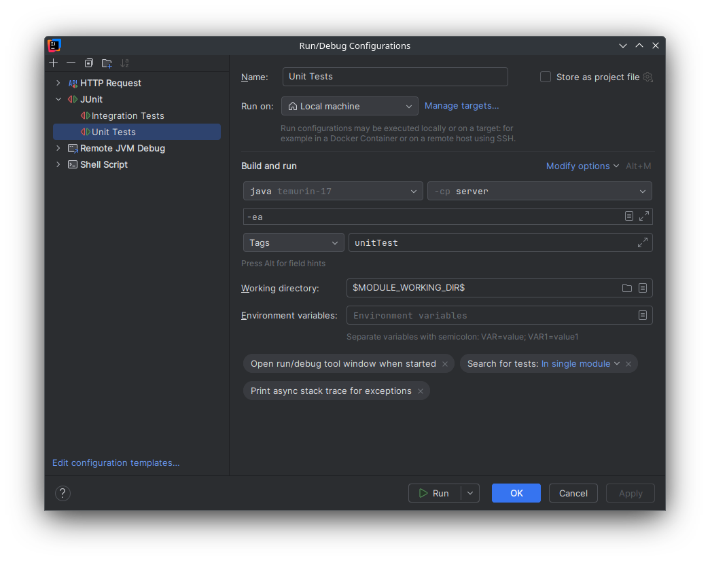
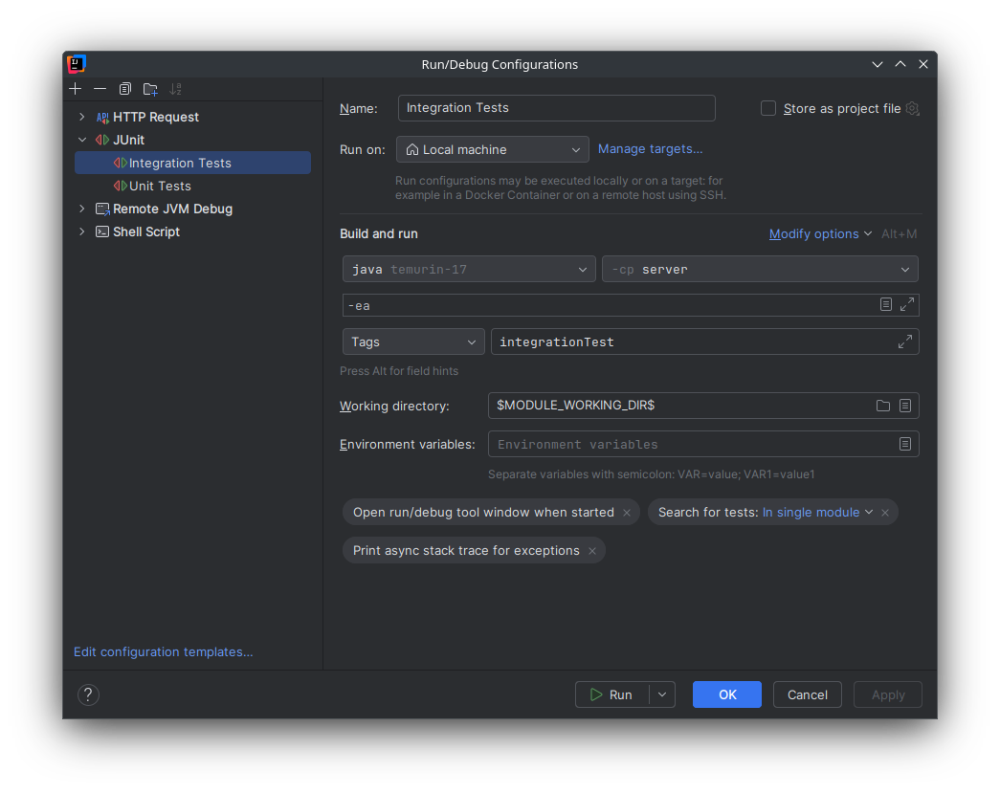

# TLS Manager plugin for Open Integration Engine

## Preparation

1. Install the tooling
    - We suggest using [sdkman](https://sdkman.io/). Then run `sdk env install`
    - Or install manually
        - [Install Java](https://www.javatpoint.com/javafx-how-to-install-java)
        - [Install Maven](https://www.javatpoint.com/how-to-install-maven)

2. Generate a self-signed certificate for a random domain name and convert it into a `.p12` keystore. We are using `yourdomain.com`.
    ```sh
    openssl req -x509 -newkey rsa:4096 -sha256 -days 365 -nodes \
      -keyout yourdomain.com.key -out yourdomain.com.crt \
      -subj "/CN=localhost" \
      -addext "subjectAltName=DNS:localhost,DNS:yourdomain.com,IP:127.0.0.1"
    
    keytool -importcert \                                                                           
      -alias myserver \
      -file yourdomain.com.crt \
      -keystore truststore.p12 \
      -storetype PKCS12 \
      -storepass changeit \
      -noprompt
    ```

3. Move the three files (`.crt`, `.key`, `.p12`) into `docker/certs/`.

## Compilation

Run `./build.sh`.

## Testing

### Unit-testing

Simply run from commandline with
```shell
mvn test -Dgroups=unitTest
```

Or via IntelliJ


### Integration testing

Integration testing is built into the included JUnit test-suite. All integration tests are tagged with `integrationTest`.
This tag is read by Junit to determine which test to execute.


#### Running tests

To run the integration test suite the caddy server must be started. Run the following command in the `docker/` directory.
```shell
docker compose up -d caddy
```

Then start all tests with the `integrationTest` tag. This can be done either via commandline:
```shell
mvn test -Dgroups=integrationTest
```

Or from IntelliJ:

